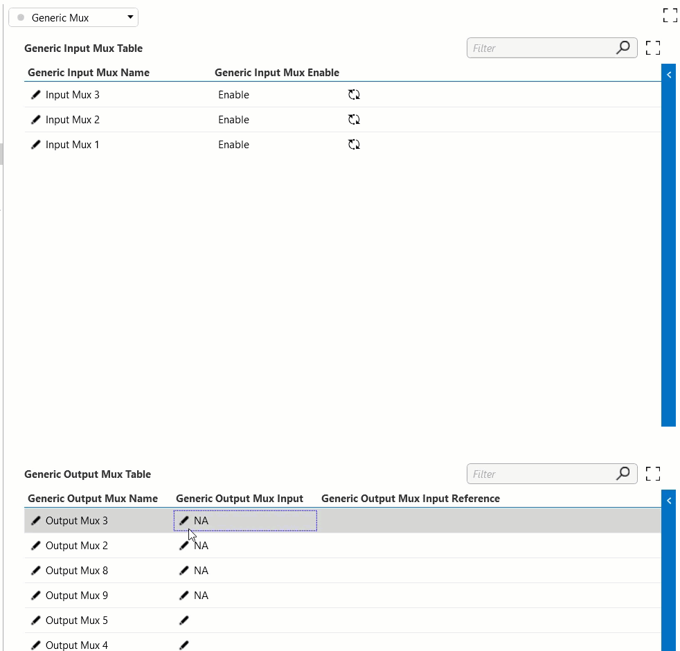

# Mux Resource Orchestration

# Overview

A fictitious case of a resource orchestration is implemented by using a virtual connector that provides two types of virtual functions.:

1. Input Mux: Based from a table that contains each input with a name, and toggle button to enable the input.
2. Output Mux: A table containing the name, input mux, and a reference of the input can be used. When the user enters an input mux name from the input mux, the protocol searches for the corresponding row in the input table and configures its reference column with the input's primary key.

The lab will configure a new Booking Manager and create an automation script to receive the resources and the time of a new booking. 

When the booking starts, the orchestration shall configure the Output Mux resource with the name of the assigned Input Mux, so that the connector will automatically set the reference. When finishing, the orchestration shall set the value NA to the Output so that the connector will clear the previously assigned reference. 

# Implementation

## Preparation

To speed up the lab, we have uploaded an Automation Script solution with all the necessary files and an initial sample of the Automation that shall be used to silently create bookings.